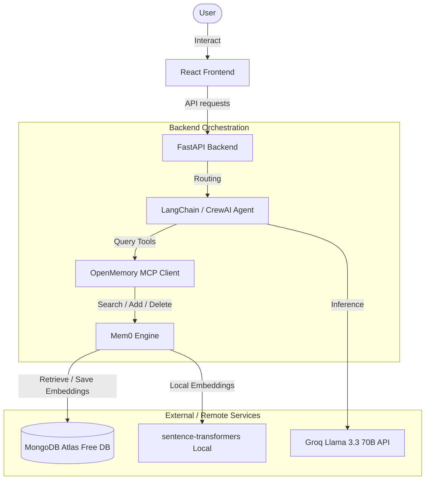

# Project Overview: AI Assistant with Persistent Memory

You are building **"AI Assistant with Memory"** — a full-stack, stateful AI assistant that maintains long-term memory of a user's facts, preferences, and chat history. The assistant retrieves relevant memories at runtime and uses them to personalize responses.

---

## Tech Stack (Zero Infrastructure Cost)

- **Backend:** FastAPI (Python 3.11+)
- **Orchestration:** LangChain (Single-Agent) & CrewAI (Multi-Agent)
- **LLM:** Groq API (free tier) with `llama-3.3-70b-specdec` or similar current model
- **Embeddings:** Local `sentence-transformers` (`all-MiniLM-L6-v2`), 384-dimensional
- **Memory Layer:** Mem0 (`mem0ai`)
- **Database:** MongoDB Atlas (Free Tier M0 cluster) — handles both Mem0 vector embeddings and conversation history
- **Tool Protocol:** Model Context Protocol (MCP) via OpenMemory MCP
- **Frontend:** React + Vite (HTML/CSS/JS)
- **Containerization:** Docker & Docker Compose (local run only)

---

## Architecture Flow



---

## Proposed Project Structure

Ensure all implementation steps write files conforming to the structure below:

```text
ai-assistant-memory/
  backend/
    app/
      __init__.py
      main.py                  # FastAPI entrypoint
      config.py                # Configuration and environment variables
      api/
        __init__.py
        chat.py                # Single-agent chat endpoints
        crew.py                # Multi-agent chat endpoints
        memory.py              # Memory inspector CRUD endpoints
      agents/
        __init__.py
        single_agent.py        # LangChain + MCP memory client orchestration
        crew_agents.py         # CrewAI Researcher + Assistant orchestration
      db/
        __init__.py
        mongo.py               # MongoDB database client and history store
      mcp/
        __init__.py
        memory_server.py       # OpenMemory MCP server wrapping Mem0
        mcp_client.py          # In-process/STDIO MCP client
    requirements.txt
    Dockerfile
  frontend/
    src/
      App.jsx
      App.css
      api.js                   # Backend API fetch wrappers
      components/
        ChatWindow.jsx
        ChatWindow.css
        MemoryInspector.jsx
        MemoryInspector.css
    index.html
    package.json
    vite.config.js
    Dockerfile.dev
  docker-compose.yml
  .env.example
  README.md
  tests/
    __init__.py
    test_memory_recall.py      # Recall validation test suite
    test_crew_shared_memory.py # CrewAI shared memory validation test suite
```

---

## Core Development Constraints

1. **Strict Cost Limit ($0):** Do not introduce any paid APIs, database subscriptions, or services.
2. **Local Embedding Run:** Run embedding models (`sentence-transformers`) locally inside the python process.
3. **No Local DB Setup:** Do not write local MongoDB setup in code or docker-compose. All DB storage must connect to the hosted MongoDB Atlas cluster using the connection URI.
4. **Environment Variables:** All secrets (Groq API Key, MongoDB Atlas connection string) must reside in a `.env` file (which must be gitignored).
5. **Decoupled Architecture:** Keep the MCP server separate from client agents so it can be swapped or used by standard MCP clients.
